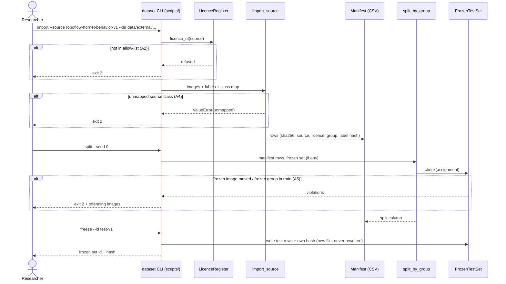

# Sequence diagram — import, split, freeze

> **Feature**: annotation-pipeline · **Spec**: [annotation-pipeline](../../specs/annotation-pipeline.md)
> (main scenario steps 1–5, A2, A4, A5)

```mermaid
sequenceDiagram
    actor R as Researcher
    participant CLI as dataset CLI (scripts/)
    participant Reg as LicenceRegister
    participant Imp as import_source
    participant Man as Manifest (CSV)
    participant Spl as split_by_group
    participant Frz as FrozenTestSet

    R->>CLI: import --source roboflow-hornet-behavior-v1 --dir data/external/...
    CLI->>Reg: licence_of(source)
    alt not in allow-list (A2)
        Reg-->>CLI: refused
        CLI-->>R: exit 2
    end
    CLI->>Imp: images + labels + class map
    alt unmapped source class (A4)
        Imp-->>CLI: ValueError(unmapped)
        CLI-->>R: exit 2
    end
    Imp-->>Man: rows (sha256, source, licence, group, label hash)
    R->>CLI: split --seed 0
    CLI->>Spl: manifest rows, frozen set (if any)
    Spl->>Frz: check(assignment)
    alt frozen image moved / frozen group in train (A5)
        Frz-->>CLI: violations
        CLI-->>R: exit 2 + offending images
    end
    Spl-->>Man: split column
    R->>CLI: freeze --id test-v1
    CLI->>Frz: write test rows + own hash (new file, never rewritten)
    CLI-->>R: frozen set id + hash
```
