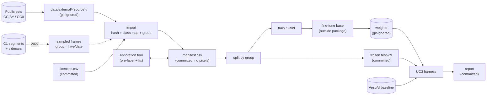

# Data-flow diagram — from source to scored model

> **Feature**: annotation-pipeline · **Spec**: [annotation-pipeline](../../specs/annotation-pipeline.md)

```mermaid
flowchart LR
    Pub[("Public sets<br/>CC BY / CC0")] --> Ext["data/external/&lt;source&gt;/<br/>(git-ignored)"]
    C1[("C1 segments<br/>+ sidecars")] -. "2027" .-> Frames["sampled frames<br/>group = hive/date"]
    Ext --> Imp["import<br/>hash + class map + group"]
    Frames -.-> Imp
    Reg["licences.csv<br/>(committed)"] --> Imp
    Imp --> Man["manifest.csv<br/>(committed, no pixels)"]
    Tool["annotation tool<br/>(pre-label + fix)"] <--> Man
    Man --> Split["split by group"]
    Split --> Train["train / valid"]
    Split --> Frozen["frozen test-vN<br/>(committed)"]
    Train --> Fit["fine-tune base<br/>(outside package)"]
    Fit --> Model[("weights<br/>(git-ignored)")]
    Model --> Score["UC3 harness"]
    Frozen --> Score
    VespAI[("VespAI baseline")] --> Score
    Score --> Report["report<br/>(committed)"]
```
